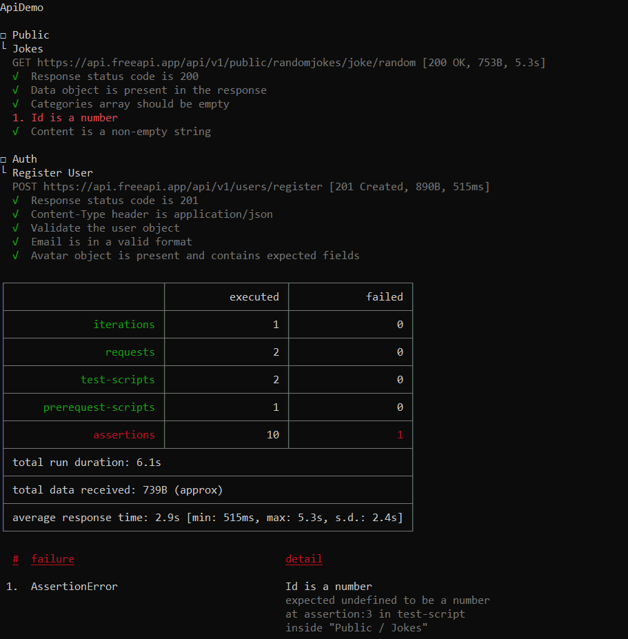

# FreeAPI Demo with Newman CLI

This repository contains a Postman collection and environment to demonstrate the FreeAPI services, including a random joke API and user registration.

## Requirements

1. Install **Newman CLI** to run the collection.
   - Install Node.js from [here](https://nodejs.org/).
   - Install Newman by running the following command:

     ```bash
     npm install -g newman
     ```

2. **Export Postman Collection & Environment**:
   - **Collection JSON**: `ApiDemo.postman_collection.json`
   - **Environment JSON**: `Free Api Demo.postman_environment.json`

   These files should be downloaded and placed in the project directory.

## Functions Used

### `getRandomUser`
Generates a random user with:
- Random name
- Random email
- Password set to "Password123"

The user data is stored in the environment as `randomUser`.

### `getRandomRoles`
Generates a random user role (Admin, User) and stores it in the environment as `randomRoles`.

## How to Run the Collection Using Newman CLI

1. Download the following files:
   - **[Collection JSON]**
   - **[Environment JSON]**

2. Run the collection using the following command:

   ```bash
   newman run "ApiDemo.postman_collection.json" -e "Free Api Demo.postman_environment.json"
   ```

  
     
     
